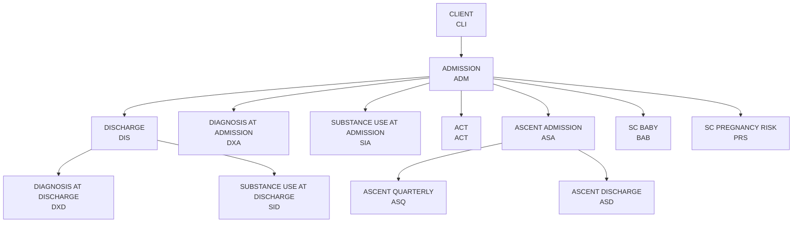

## Schema Hierarchy

The CoBHRM Unified Data Model follows a hierarchical structure where records are linked through unique identifiers. Understanding these relationships is essential for successful data submission.

## Record Type Codes

Each schema is identified by a unique record type code:

| Code | Schema | Description | Parent Record |
|------|--------|-------------|---------------|
| `CLI` | Client | Demographics and identifiers | None (root) |
| `ADM` | Admission | Treatment episode admission | Client |
| `DIS` | Discharge | Treatment episode discharge | Admission |
| `DXA` | Diagnosis at Admission | Clinical diagnoses at intake | Admission |
| `DXD` | Diagnosis at Discharge | Clinical diagnoses at discharge | Discharge |
| `SIA` | Substance Use at Admission | Substance use information at intake | Admission |
| `SID` | Substance Use at Discharge | Substance use information at discharge | Discharge |
| `ACT` | ACT | Assertive Community Treatment data | Admission |
| `ASA` | Ascent Admission | Youth residential admission | Admission |
| `ASQ` | Ascent Quarterly | Youth residential quarterly assessment | Ascent Admission |
| `ASD` | Ascent Discharge | Youth residential discharge | Ascent Admission |
| `BAB` | SC Baby | Special Connections baby outcomes | Admission |
| `PRS` | SC Pregnancy Risk | Special Connections pregnancy risk | Admission |

## Key Identifiers

### Primary Identifiers

Records are linked using these key fields:

| Field | Description | Used In |
|-------|-------------|---------|
| `BHASO_CLIENT_IDENTIFIER` | Unique client ID assigned by BHASO | All schemas |
| `BHASO_CASE_IDENTIFIER` | Unique treatment episode ID | Admission and child records |
| `EFFECTIVE_DATE` | Record effective date | All schemas |

### Linking Records

<Steps>
  <Step title="Client Record">
    Create a CLIENT (CLI) record first with a unique `BHASO_CLIENT_IDENTIFIER`
  </Step>
  <Step title="Admission Record">
    Create an ADMISSION (ADM) record that references the client via `BHASO_CLIENT_IDENTIFIER` and assigns a unique `BHASO_CASE_IDENTIFIER`
  </Step>
  <Step title="Child Records">
    Create related records (Diagnosis, Substance Use, etc.) that reference both `BHASO_CLIENT_IDENTIFIER` and `BHASO_CASE_IDENTIFIER`
  </Step>
  <Step title="Discharge Record">
    Create a DISCHARGE (DIS) record when the treatment episode ends, using the same identifiers
  </Step>
</Steps>

## Cardinality

| Relationship | Cardinality | Notes |
|--------------|-------------|-------|
| Client → Admission | 1:N | One client can have multiple admissions |
| Admission → Discharge | 1:1 | Each admission has at most one discharge |
| Admission → Diagnosis (ADM) | 1:N | Multiple diagnoses per admission |
| Discharge → Diagnosis (DIS) | 1:N | Multiple diagnoses per discharge |
| Admission → Substance Use (ADM) | 1:N | Multiple substances per admission |
| Discharge → Substance Use (DIS) | 1:N | Multiple substances per discharge |
| Admission → ACT | 1:N | Multiple ACT records per admission |
| Admission → Ascent | 1:1 | One Ascent admission per treatment episode |
| Ascent → Quarterly | 1:N | Multiple quarterly assessments |
| Ascent → Discharge | 1:1 | One Ascent discharge |

## Version History

The current version of the UDM is **2025**. Historical records maintain backward compatibility with previous versions.

<Note>
When submitting records, always use the current UDM version specifications to ensure compatibility with the BHA data warehouse.
</Note>
