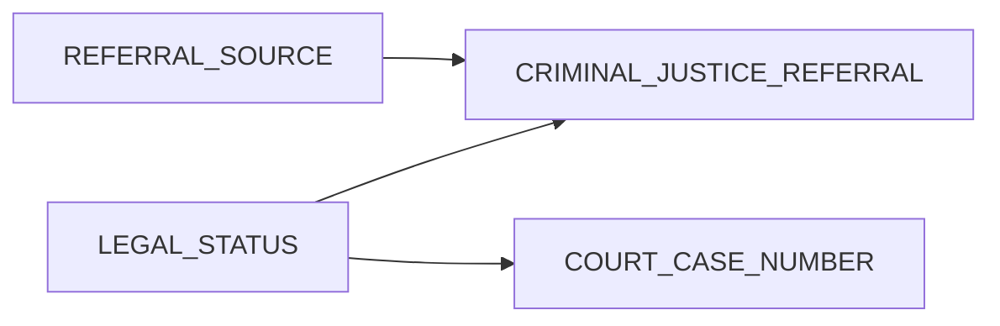

## Overview

The `LEGAL_STATUS` field captures the client's legal status at the time of admission. This is important for tracking court-involved clients and understanding criminal justice pathways into treatment.

## Legal Status Codes

| Code | Description |
|------|-------------|
| `01` | No Legal Involvement |
| `02` | Awaiting Trial/Adjudication |
| `03` | Probation |
| `04` | Parole |
| `05` | Pretrial Diversion |
| `06` | Drug Court |
| `07` | Mental Health Court |
| `08` | Civil Commitment (Involuntary) |
| `09` | M1 Hold (72-hour hold) |
| `10` | Court-Ordered Treatment (Other) |
| `11` | Incarcerated (Jail) |
| `12` | Incarcerated (Prison) |
| `13` | Juvenile Detention |
| `14` | Juvenile Probation |
| `15` | Child Welfare Involvement |
| `97` | Unknown |
| `99` | Other Legal Status |

## Usage Example

```csv
LEGAL_STATUS
03
```

## Conditional Requirements

When `LEGAL_STATUS` indicates criminal justice involvement (codes 02-07, 10-14):

| Condition | Required Field |
|-----------|----------------|
| `LEGAL_STATUS` in (02, 03, 04, 06, 07, 10) | `COURT_CASE_NUMBER` recommended |
| `LEGAL_STATUS` in (02-14) | `CRIMINAL_JUSTICE_REFERRAL` should be `1` |

## Legal Status Categories

### No Involvement (01)
Client has no current legal issues affecting treatment.

### Pre-Conviction (02, 05)
Client is in the legal system but not yet convicted:
- **Awaiting Trial** - Charges filed, trial pending
- **Pretrial Diversion** - Alternative to prosecution

### Community Supervision (03-04)
Client is under supervision in the community:
- **Probation** - Court supervision instead of incarceration
- **Parole** - Supervised release from incarceration

### Specialty Courts (06-07)
Problem-solving court programs:
- **Drug Court** - Substance use-focused
- **Mental Health Court** - Mental health-focused

### Civil/Mental Health (08-09)
Non-criminal legal involvement:
- **Civil Commitment** - Court-ordered psychiatric treatment
- **M1 Hold** - Emergency 72-hour psychiatric hold

### Incarceration (11-12)
Currently incarcerated but receiving treatment:
- **Jail** - Pre-trial or short-term (usually <1 year)
- **Prison** - Post-conviction (usually ≥1 year)

### Juvenile (13-14)
Youth-specific legal involvement.

### Child Welfare (15)
Involvement with child protective services.

## Relationship to Other Fields



<Tip>
Ensure consistency between `LEGAL_STATUS`, `REFERRAL_SOURCE`, and `CRIMINAL_JUSTICE_REFERRAL` fields.
</Tip>
