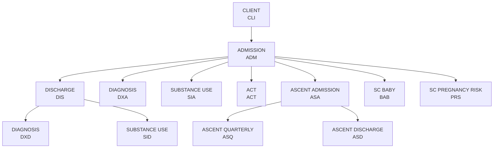

## Overview

The CoBHRM data model uses referential integrity to link records across schemas. Understanding these dependencies is critical for successful data submission - parent records must exist before child records can be created.

## Dependency Diagram



## Foreign Key Reference

| Child Schema | Parent Schema | Foreign Key Field(s) | Constraint |
|--------------|---------------|---------------------|------------|
| ADMISSION | CLIENT | `BHASO_CLIENT_IDENTIFIER` | Client must exist |
| DISCHARGE | ADMISSION | `BHASO_CASE_IDENTIFIER` | Admission must exist |
| DIAGNOSIS (DXA) | ADMISSION | `BHASO_CASE_IDENTIFIER` | Admission must exist |
| DIAGNOSIS (DXD) | DISCHARGE | `BHASO_CASE_IDENTIFIER` | Discharge must exist |
| SUBSTANCE USE (SIA) | ADMISSION | `BHASO_CASE_IDENTIFIER` | Admission must exist |
| SUBSTANCE USE (SID) | DISCHARGE | `BHASO_CASE_IDENTIFIER` | Discharge must exist |
| ACT | ADMISSION | `BHASO_CASE_IDENTIFIER` | Admission must exist |
| ASCENT (ASA) | ADMISSION | `BHASO_CASE_IDENTIFIER` | Admission must exist |
| ASCENT (ASQ) | ASCENT (ASA) | `BHASO_CASE_IDENTIFIER` | ASA must exist |
| ASCENT (ASD) | ASCENT (ASA) | `BHASO_CASE_IDENTIFIER` | ASA must exist |
| SC BABY | ADMISSION | `BHASO_CASE_IDENTIFIER` | Admission must exist |
| SC PREGNANCY RISK | ADMISSION | `BHASO_CASE_IDENTIFIER` | Admission must exist |

## Submission Order

Records must be submitted in dependency order:

<Steps>
  <Step title="Level 1: CLIENT">
    Submit all CLIENT (CLI) records first
  </Step>
  <Step title="Level 2: ADMISSION">
    Submit ADMISSION (ADM) records that reference existing clients
  </Step>
  <Step title="Level 3a: Admission Children">
    Submit records that depend only on ADMISSION:
    - DIAGNOSIS at Admission (DXA)
    - SUBSTANCE USE at Admission (SIA)
    - ACT
    - ASCENT Admission (ASA)
    - SC BABY (BAB)
    - SC PREGNANCY RISK (PRS)
  </Step>
  <Step title="Level 3b: DISCHARGE">
    Submit DISCHARGE (DIS) records
  </Step>
  <Step title="Level 4: Discharge Children">
    Submit records that depend on DISCHARGE:
    - DIAGNOSIS at Discharge (DXD)
    - SUBSTANCE USE at Discharge (SID)
  </Step>
  <Step title="Level 4: ASCENT Follow-ups">
    Submit ASCENT records that depend on ASA:
    - ASCENT Quarterly (ASQ)
    - ASCENT Discharge (ASD)
  </Step>
</Steps>

## Key Fields

### BHASO_CLIENT_IDENTIFIER

- **Purpose**: Uniquely identifies a client across all records
- **Assigned by**: BHASO (provider organization)
- **Format**: Alphanumeric, up to 20 characters
- **Scope**: All schemas reference this identifier

```csv
# All records for the same client use the same identifier
BHASO_CLIENT_IDENTIFIER
CLT-000001
```

### BHASO_CASE_IDENTIFIER

- **Purpose**: Uniquely identifies a treatment episode
- **Assigned by**: BHASO (provider organization)
- **Format**: Alphanumeric, up to 20 characters
- **Scope**: ADMISSION and all child schemas

```csv
# Admission creates the case identifier
RECORD_TYPE,BHASO_CLIENT_IDENTIFIER,BHASO_CASE_IDENTIFIER
ADM,CLT-000001,CSE-000001

# Child records reference the same case identifier
RECORD_TYPE,BHASO_CLIENT_IDENTIFIER,BHASO_CASE_IDENTIFIER
DIS,CLT-000001,CSE-000001
DXA,CLT-000001,CSE-000001
SIA,CLT-000001,CSE-000001
```

## Referential Integrity Errors

| Error Code | Message | Resolution |
|------------|---------|------------|
| `REF-001` | Client not found: `{client_id}` | Submit CLIENT record first |
| `REF-002` | Admission not found: `{case_id}` | Submit ADMISSION record first |
| `REF-003` | Discharge not found: `{case_id}` | Submit DISCHARGE record first (for DXD/SID) |
| `REF-004` | Ascent admission not found: `{case_id}` | Submit ASA record first (for ASQ/ASD) |

## Batch File Considerations

When submitting multiple schemas in batch files:

### Option 1: Separate Files per Schema

Submit files in dependency order:
1. `clients.csv`
2. `admissions.csv`
3. `diagnoses_admission.csv`
4. `discharges.csv`
5. `diagnoses_discharge.csv`

### Option 2: Combined File

Include records in dependency order within a single file:
```csv
RECORD_TYPE,...
CLI,...
CLI,...
ADM,...
ADM,...
DXA,...
DXA,...
```

<Warning>
If using a combined file, ensure parent records appear before child records. The system processes records sequentially.
</Warning>

## Cardinality Rules

| Parent | Child | Cardinality | Notes |
|--------|-------|-------------|-------|
| CLIENT | ADMISSION | 1:N | Multiple treatment episodes allowed |
| ADMISSION | DISCHARGE | 1:1 | One discharge per admission |
| ADMISSION | DIAGNOSIS (DXA) | 1:N | Multiple diagnoses allowed |
| DISCHARGE | DIAGNOSIS (DXD) | 1:N | Multiple diagnoses allowed |
| ADMISSION | SUBSTANCE USE (SIA) | 1:N | Multiple substances allowed |
| DISCHARGE | SUBSTANCE USE (SID) | 1:N | Multiple substances allowed |
| ADMISSION | ACT | 1:N | Multiple monthly records |
| ADMISSION | ASCENT (ASA) | 1:1 | One Ascent admission |
| ASA | ASCENT (ASQ) | 1:N | Multiple quarterly assessments |
| ASA | ASCENT (ASD) | 1:1 | One Ascent discharge |
| ADMISSION | SC BABY | 1:N | Multiple babies (twins, etc.) |
| ADMISSION | SC PREGNANCY RISK | 1:N | Multiple assessments |
